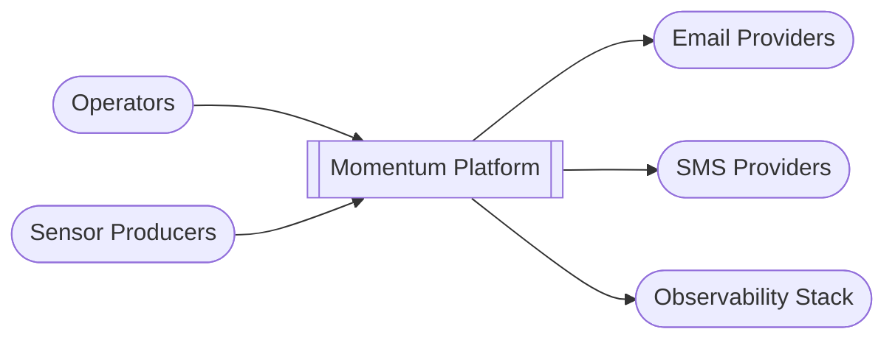
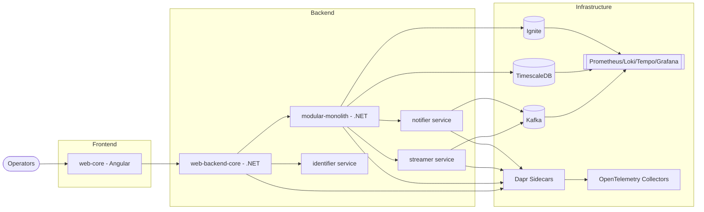
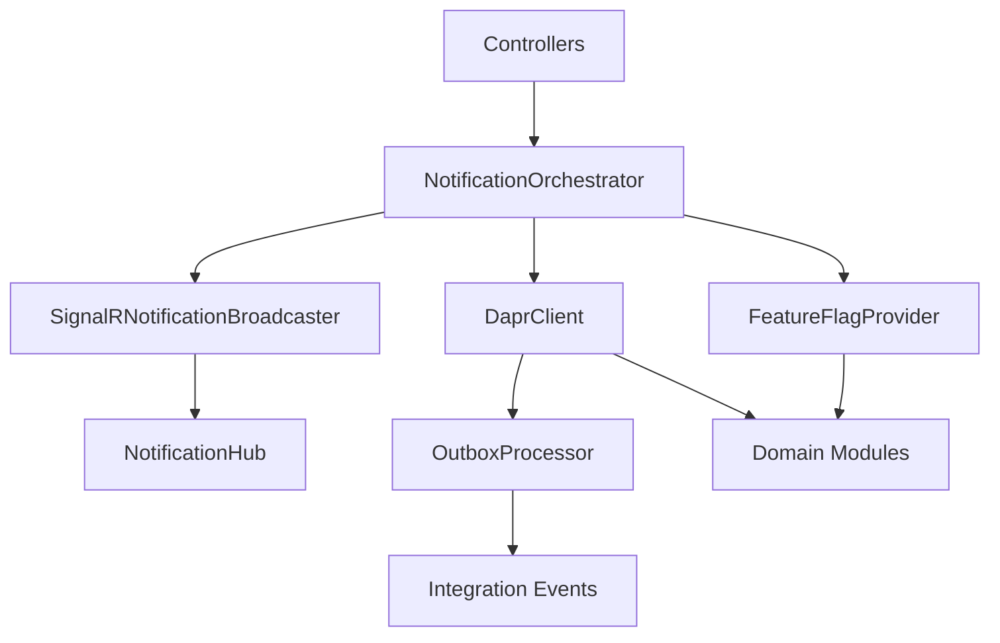
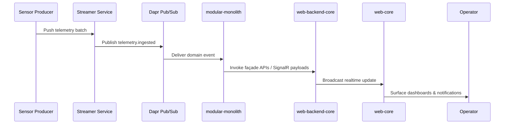

# Architecture Overview (C4)

## C1 – System Context
- **Momentum Platform** ingests telemetry, manages identities, and broadcasts notifications.
- External actors: Operators (web UI), sensor producers (Kafka), email/SMS providers, observability stack.

## C2 – Container Diagram
- **web-core (Angular):** shell consuming SignalR, federated Angular modules, and OpenFeature flags.
- **web-backend-core (.NET):** API gateway + SignalR hub + OpenFeature integration. Acts as the single ingress for the frontend and exposes façade endpoints for external integrations.
- **modular-monolith (.NET):** Unified façade invoking all services via Dapr. Hosts domain modules when running in monolith mode and proxies to extracted services in distributed setups.
- **identifier service:** gRPC auth, JWT minting, feature flag bootstrap.
- **streamer service:** Kafka consumer, TimescaleDB persistence, Ignite cache invalidation.
- **notifier service:** Subscribes to `telemetry.ingested`, dispatches email/SignalR and webhooks.
- **Infrastructure:** Kafka, TimescaleDB, Ignite, Prometheus, Loki, Tempo, Grafana, Dapr sidecars, OpenTelemetry collectors.

## C3 – Component Diagram (web-backend-core)
- Controllers orchestrate requests and enforce API versioning.
- `NotificationOrchestrator` coordinates broadcasts, retries, and fan-out semantics.
- `SignalRNotificationBroadcaster` publishes to the hub and translates domain events into realtime payloads.
- `NotificationHub` exposes the realtime channel and manages groups per module.
- `DaprClient` handles module invocations and pub/sub operations.
- `FeatureFlagProvider` resolves OpenFeature toggles injected into downstream modules.
- `OutboxProcessor` ensures at-least-once delivery for integration events.

## C4 – Code/Module View
- Clean architecture layers per service (`Domain` → `Application` → `Infrastructure` → `Api`).
- Versioned contracts in `/contracts`.
- Tests in `/tests`.
- Module federation powering the modular frontend.
- Bounded contexts align with modules under `/modules` and share the same Dapr invocation semantics when extracted into services.
- Shared kernel projects host primitives (base exceptions, integration events, OpenTelemetry instrumentation).
- Feature flags, localization, and authorization policies live in dedicated cross-cutting libraries reused by modules.

## Quality Attributes
- **Resilience:** Dapr retries, circuit breakers, Kafka buffering, Ignite caching, outbox processors for reliable delivery.
- **Observability:** OpenTelemetry/Prometheus, logs in Loki, traces in Tempo, dashboards in Grafana per bounded context.
- **Security:** JWT, roles, feature flags via OpenFeature, secret rotation managed through Aspire secrets and Azure Key Vault (production).
- **Evolvability:** Stable contracts, bounded contexts per module, plug-in modules, contract-first pipelines preventing breaking changes.
- **Operability:** Aspire orchestrations for local parity, Infrastructure as Code pipelines, health endpoints per service.

## Dapr building blocks & messaging patterns
- **Service invocation:** Each backend module exposes Dapr-invokable endpoints registered under `modular-monolith` or the extracted service ID.
- **Pub/Sub:** Kafka topics follow the `<bounded-context>.<event>` naming convention; consumers rely on Dapr components defined under `src/*/Components/`.
- **Bindings:** Outgoing email/SMS/webhook adapters are encapsulated in Dapr bindings to enable swapping providers without code changes.
- **State store:** Ignite is accessed via the Dapr state store for cache-coherent operations between services.

## Data & storage strategy
- **Operational data:** PostgreSQL/TimescaleDB instances per bounded context (schema-first migrations in `/src/*/Migrations`).
- **Historical data:** Timescale hypertables store telemetry and analytics workloads with retention managed by policies.
- **Caching:** Ignite serves as the distributed cache and secondary index for high-throughput reads.
- **Secrets/configuration:** Development secrets live in `.env`/Aspire user secrets; production relies on Azure Key Vault or HashiCorp Vault (TBD).

## Development workflow highlights
1. Design contracts and domain models in the targeted module (see [`docs/06-Modular-Architecture-Guidelines.md`](docs/06-Modular-Architecture-Guidelines.md)).
2. Implement Clean Architecture layers and register Dapr components.
3. Add unit/integration/contract tests and wire them to `make test`.
4. Document the change (`docs/`, `README.md`) and add ADRs under `docs/adr/` when introducing architectural decisions.
5. Update release notes via the automation workflow before tagging.

## Event Flow Overview

