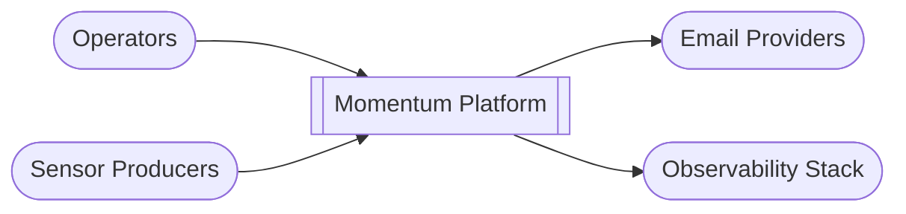
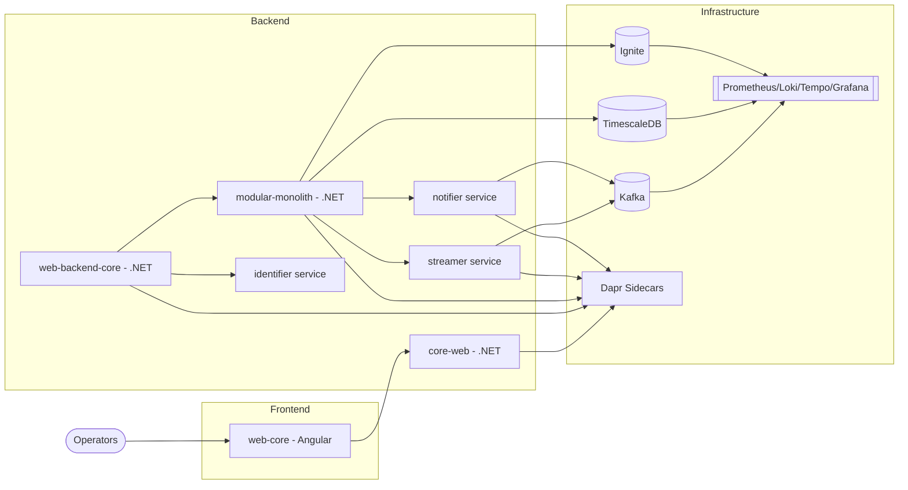
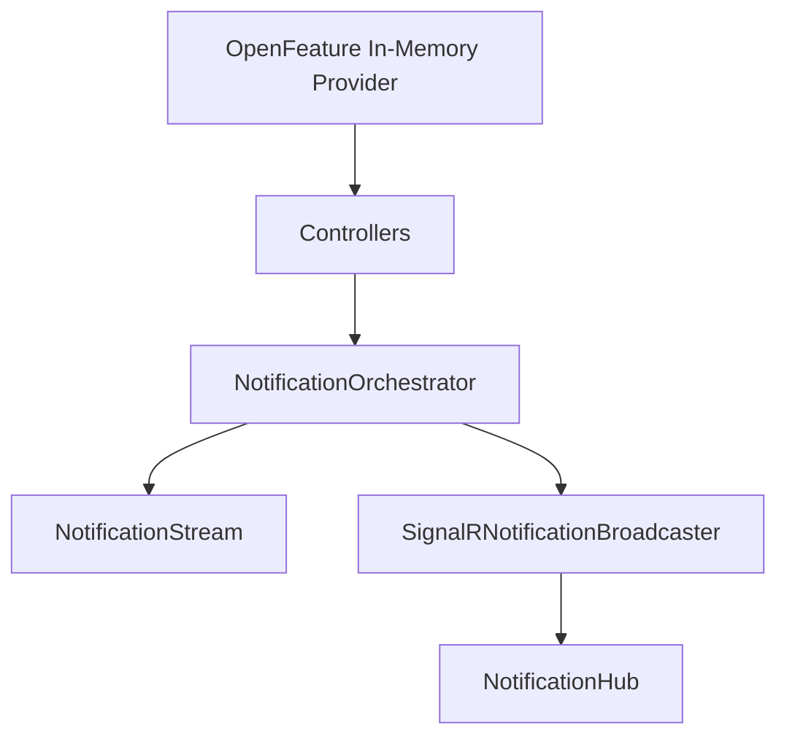
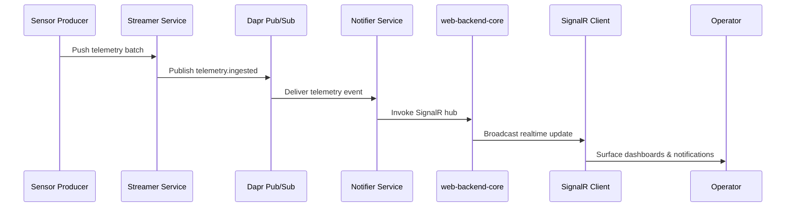

# Architecture Overview (C4)

## C1 – System Context
- **Momentum Platform** ingests telemetry, manages identities, and broadcasts notifications.
- External actors: Operators (web UI), sensor producers (Kafka), email providers (Azure Communication Email), observability stack.

## C2 – Container Diagram
- **web-core (Angular):** shell consuming SignalR, federated Angular modules, and translation resources.
- **core-web (.NET):** UI gateway for manifest/menu/i18n/auth and SignalR hub for shell events.
- **web-backend-core (.NET):** API gateway + SignalR hub + OpenFeature in-memory provider. Exposes façade endpoints for external integrations and notification broadcasts.
- **modular-monolith (.NET):** Unified façade invoking services via Dapr. Hosts domain modules when running in monolith mode and proxies to extracted services in distributed setups.
- **identifier service:** gRPC + HTTP auth, licensing, feature flags (PostgreSQL/Timescale backed).
- **streamer service:** Kafka consumer, TimescaleDB persistence, publishes `telemetry.ingested` via Dapr.
- **notifier service:** Subscribes to `telemetry.ingested`, dispatches email and SignalR (via `web-backend-core` hub).
- **Infrastructure:** Kafka (Redpanda in compose), TimescaleDB, Ignite (provisioned), Prometheus, Loki, Tempo, Grafana, Dapr sidecars (Aspire).

## C3 – Component Diagram (web-backend-core)
- Controllers orchestrate requests and call the application layer.
- `NotificationOrchestrator` coordinates broadcasts and appends events to the in-memory `NotificationStream`.
- `SignalRNotificationBroadcaster` publishes to the hub.
- `NotificationHub` exposes the realtime channel for UI consumers.
- OpenFeature is configured with an in-memory provider during startup.

## C4 – Code/Module View
- Clean architecture layers per service (`Domain` → `Application` → `Infrastructure` → `Api`).
- Versioned contracts in `/contracts`.
- Tests in `/tests`.
- Module federation powering the modular frontend.
- Bounded contexts align with modules under `/modules` and share the same Dapr invocation semantics when extracted into services.
- Shared kernel projects host primitives (base exceptions, integration events, OpenTelemetry instrumentation).
- Feature flags, localization, and authorization policies live in dedicated cross-cutting libraries reused by modules.

## Quality Attributes
- **Resilience:** Dapr retries, circuit breakers, Kafka buffering, Ignite caching, outbox processors for reliable delivery.
- **Observability:** OpenTelemetry/Prometheus, logs in Loki, traces in Tempo, dashboards in Grafana per bounded context.
- **Security:** JWT, roles, feature flags via OpenFeature, secret rotation managed through Aspire secrets and Azure Key Vault (production).
- **Evolvability:** Stable contracts, bounded contexts per module, plug-in modules, contract-first pipelines preventing breaking changes.
- **Operability:** Aspire orchestrations for local parity, Infrastructure as Code pipelines, health endpoints per service.

## Dapr building blocks & messaging patterns
- **Service invocation:** Backend services are registered with Dapr in the Aspire AppHost (`src/AppHost/AppHost.cs`).
- **Pub/Sub:** Kafka topics follow the `<bounded-context>.<event>` naming convention; component stubs live under `src/AppHost/mounts/dapr/components/` (currently empty placeholders that must be filled for local runs).
- **Bindings:** Email dispatch uses the `Azure.Communication.Email` SDK directly; Dapr bindings are not configured yet.
- **State store:** Ignite is provisioned as infrastructure but no Dapr state store configuration is defined in the repo.

## Data & storage strategy
- **Operational data:** Identifier persists to PostgreSQL/TimescaleDB with EF Core migrations under `src/services/identifier/Identifier.Infrastructure/Migrations`.
- **Historical data:** Streamer writes telemetry to Timescale using raw Npgsql commands.
- **Caching:** Ignite is provisioned (Docker/Aspire) but not referenced by runtime code yet.
- **Secrets/configuration:** Service settings live in `appsettings.json` with environment overrides; no Key Vault/Vault integration is configured in this repo.

## Development workflow highlights
1. Design contracts and domain models in the targeted module (see [`docs/06-Modular-Architecture-Guidelines.md`](docs/06-Modular-Architecture-Guidelines.md)).
2. Implement Clean Architecture layers and register Dapr components.
3. Add unit/integration/contract tests and wire them to `make test`.
4. Document the change (`docs/`, `README.md`) and add ADRs under `docs/adr/` when introducing architectural decisions.
5. Update release notes via the automation workflow before tagging.

## Event Flow Overview

