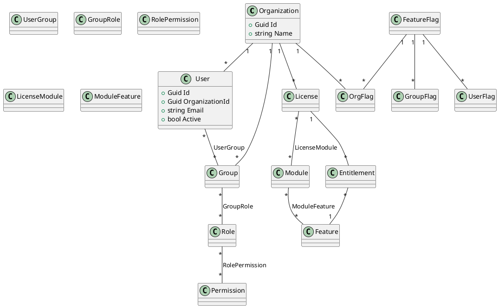
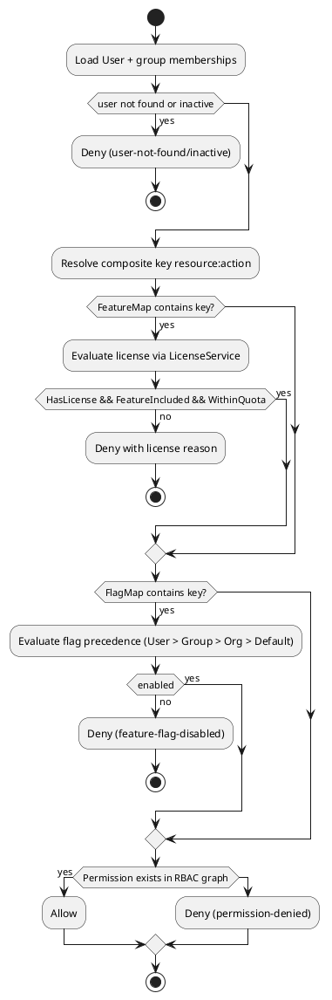

# Identifier bounded context

The Identifier bounded context provides multi-tenant RBAC, licensing, and feature flag evaluation for Momentum. It is delivered as an isolated vertical slice that can be hosted independently and progressively integrated with other services via feature flags.

## Solution layout

```
src/services/identifier/
 ├─ Identifier.Domain/            // Entities shared across the bounded context
 ├─ Identifier.Application/       // Contracts, options, cache abstractions
 ├─ Identifier.Infrastructure/    // EF Core DbContext, services, migrations, seed
 └─ Identifier.Api/               // Minimal Web API (authZ, licensing, flag endpoints)

tests/Identifier/
 ├─ Identifier.Application.Tests/     // Unit tests for engines/providers/services
 └─ Identifier.Api.IntegrationTests/  // WebApplicationFactory based integration tests
```

## Domain model



## Authorization pipeline



## Feature flag precedence

1. **UserFlag** override
2. **GroupFlag** (first match in `groupIds` order)
3. **OrgFlag** override
4. **FeatureFlag.DefaultVariation**

Flags are cached through `IIdentifierCache` (default in-memory implementation) so that repeated evaluations are fast. Variations accept `on/true/1/enabled/yes` for truthy values.

## Licensing model

| Concept            | Description                                                |
|--------------------|------------------------------------------------------------|
| License            | Issued per organization; contains tier, validity window.   |
| LicenseModule      | Enables a module (collection of features).                 |
| Module             | Groups coherent features (e.g. `iot.core`, `realtime`).    |
| Entitlement        | Direct grant of a feature with optional quota.             |
| Feature            | Permissionable capability (e.g. `devices.core`).           |
| FeatureMap         | Resource/action → feature key resolution in appsettings.   |

License evaluation ensures the license is currently valid and that the requested feature is available either directly via entitlement or indirectly via a licensed module.

## API surface

| Method | Route                                             | Description                                   |
|--------|----------------------------------------------------|-----------------------------------------------|
| GET    | `/api/identifier/authorize`                        | Evaluate RBAC + license + flag for a user.    |
| GET    | `/api/identifier/flags/{flagKey}`                  | Returns enabled status for a flag.            |
| GET    | `/api/identifier/flags/{flagKey}/evaluate`         | Returns variation and enabled flag precedence |
| GET    | `/api/identifier/license/has-feature/{featureKey}` | Check if organization can access a feature.   |
| POST   | `/api/identifier/seed`                             | Seed deterministic baseline data (config gated). |

### Example requests

```bash
# Authorize seeded admin user
curl "http://localhost:5086/api/identifier/authorize" \
  --get \
  --data-urlencode "userId=08fb1fb2-541d-4720-9f61-89d33bd44ddc" \
  --data-urlencode "resource=devices" \
  --data-urlencode "action=manage"

# Evaluate flag precedence
curl "http://localhost:5086/api/identifier/flags/ui.newDashboard/evaluate" \
  --get \
  --data-urlencode "orgId=3f7b5937-5e63-4d0e-8267-29aef39915af" \
  --data-urlencode "userId=08fb1fb2-541d-4720-9f61-89d33bd44ddc"
```

## Configuration

`appsettings.json` exposes the following keys:

```json
{
  "ConnectionStrings": {
    "Identifier": "Server=...;Database=Momentum.Identifier;..."
  },
  "Identifier": {
    "Authorization": {
      "FeatureMap": { "devices:manage": "devices.core" },
      "FlagMap": { "devices:manage": "ui.newDashboard" }
    },
    "Integration": { "Enabled": false },
    "Seed": { "Enabled": true }
  }
}
```

Environment overrides:

- `ConnectionStrings__Identifier` — database connection string (SQL Server).
- `IDENTIFIER__SEED_ENABLED=true` — enable the seed endpoint without editing files.
- `Identifier__Integration__Enabled=true` — allow other services to delegate authorization decisions.

## Migrations & database update

```bash
# create (already provided) migration snapshot
 dotnet ef migrations add Add_Identifier_Schema \
   -p src/services/identifier/Identifier.Infrastructure/Identifier.Infrastructure.csproj \
   -s src/services/identifier/Identifier.Api/Identifier.Api.csproj

# apply migrations
dotnet ef database update \
  -s src/services/identifier/Identifier.Api/Identifier.Api.csproj
```

> **Note:** the repository includes the initial migration `Add_Identifier_Schema`. Regenerate it if you adjust the model.

## Running & testing

```bash
# build
DOTNET_SKIP_FIRST_TIME_EXPERIENCE=1 dotnet build Momentum.sln

# run Identifier API
cd src/services/identifier/Identifier.Api
ASPNETCORE_ENVIRONMENT=Development dotnet run

# execute tests
DOTNET_SKIP_FIRST_TIME_EXPERIENCE=1 dotnet test Momentum.sln --filter Identifier
```

Integration tests use SQLite in-memory with automatic database creation. Unit tests rely on EF Core InMemory providers for deterministic behaviour.

## Seed data

`IdentifierSeeder` inserts deterministic IDs for:

- Baseline permissions: `devices:read`, `devices:manage`, `realtime:stream`.
- Roles: `Administrator`, `Viewer` (with RBAC mappings).
- Modules / features: `iot.core`, `realtime`, `devices.core`, `realtime.stream`.
- Feature flag: `ui.newDashboard` (default `off`, org override `on`).
- Demo organization + admin user with active license and entitlements.

Seeds are idempotent and can be executed via the protected `/api/identifier/seed` endpoint or during startup (when `Identifier:Seed:Enabled` is true).

## Observability & caching

- Health check at `/healthz`.
- Swagger UI in Development environment.
- Feature flag metadata cached through `MemoryIdentifierCache`. Replace by registering an alternative `IIdentifierCache` implementation (e.g. Redis-backed).

## Extensibility guidelines

1. **Add a permission**
   - Extend seed lists in `IdentifierSeeder`.
   - Update `Identifier:Authorization:FeatureMap` / `FlagMap` as needed.
   - Create migration if schema changes are required.
   - Add/adjust tests covering the new behaviour.
2. **Add a feature flag**
   - Insert via seed or POST `/seed` extension.
   - Update consumers to reference the flag key.
   - Provide tests ensuring precedence and caching.
3. **Add a module/feature**
   - Update `Module`/`Feature` entities and seeds.
   - Re-run `dotnet ef migrations add` if schema changes (e.g. new attributes).

## Deployment notes

- Containerise Identifier.Api or include it in Aspire `AppHost` (register service with SQL Server dependency, health probes, optional Dapr components for configuration/secrets).
- Export `swagger/v1/swagger.json` as part of CI artifacts for contract publishing.
- CI should execute `dotnet build`, `dotnet test`, and `dotnet ef database update` against a transient database to validate migrations.

